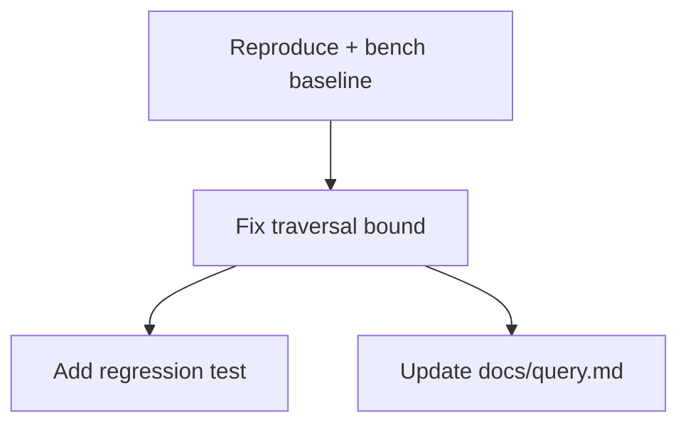

# Stage 3 - Plan (`/cogitave-flow:plan`)

Automates **Stage 3 (plan)** of the
[Request Lifecycle](../../../../../../cogitave/agents/lifecycle/LIFECYCLE.md#3-plan).
It decomposes the change, makes the **blast radius** explicit from the graph, and
binds **least-privilege scope** to each task per the
[capability model](../../../../../../cogitave/agents/identity/agent-identity-and-capabilities.md)
and `AGENTS.md` rule 5 (default deny).

## Purpose

Produce an approvable plan: an **ordered task DAG**, a **Mermaid dependency
graph**, the **blast-radius set**, and a **per-task capability scope** — never
broader than the task needs.

## When to use

- A Request is in `stage: plan` (triage signed off, security clear).
- Re-plan when the blast radius or scope changes materially.
- Do **not** use for triage, decision docs, or implementation.

## Gate this skill enforces

**Plan gate:** **plan approved** by the accountable owner (and the CODEOWNER for
every affected area). No approval -> no advance. This skill proposes the advance
only after approval is recorded.

## MCP tools & resources used

- `mcp__cogitave-core__get_request` - load the classified Request + affected nodes.
- `mcp__cogitave-core__query_graph` - the **`dependsOn` traversal** that computes
  blast radius. Use the bounded profile (depth <= 4):
  ```
  MATCH (n)-[:dependsOn*1..4]->(d) WHERE n.uid IN $affected RETURN DISTINCT d
  ```
- `mcp__cogitave-core__get_related` - corroborate edges the plan depends on.
- `mcp__cogitave-core__advance_stage` - **PROPOSE-ONLY write.** Records the plan
  (DAG + Mermaid + blast radius + scopes) and opens the advance. No mutation of
  protected state, no apply.

## Step-by-step

1. **Load.** `get_request`; read `type`/`area`/`impact` and the affected-node set
   from Stage 2.
2. **Compute blast radius.** Run the `dependsOn` traversal (depth <= 4) from the
   affected `uid`s; collect the DISTINCT downstream set. This is the impact
   surface and drives which CODEOWNERs must approve.
3. **Decompose into a DAG.** Break the work into tasks with explicit
   dependencies; order them topologically. Keep tasks small and single-purpose.
4. **Render Mermaid.** Emit a `graph TD` (or `flowchart`) diagram of the task DAG
   for the plan artifact (diagrams-as-code).
5. **Assign least-privilege scope per task.** For each task, name the exact
   capability grant it needs (tools/resources/paths) — nothing more. Flag any
   task that would need a grant the agent does not hold (it must route through a
   human grant change, never a workaround).
6. **Identify approvers.** From the blast radius, list the CODEOWNERs whose
   approval the gate requires, plus the accountable owner.
7. **Seek approval.** Present the plan; collect owner + CODEOWNER approval
   (human-in-the-loop). Hold in `plan` until approved.
8. **Propose advance (write).** On approval, call `advance_stage`. Route per
   class: **design-class / `rfcNeeded` -> `document`**; **non-design-class ->
   `implement`** (document stage is skipped, and the skip + justification are
   recorded on the Request).

## Output format

```
Request: cogitave://request/REQ-2026-0428
Blast radius (dependsOn*1..4): 6 nodes [core-query, mcp-interface, ...]
Task DAG:

Scopes:
  T2 -> repo:core path:src/query/** tools:[edit,bash:test] (least privilege)
  T4 -> repo:core path:docs/query.md tools:[edit]
Approvals required: owner cogitave/platform + CODEOWNER(core-query)
Gate: PASS - plan approved
Proposed: stage plan -> implement (non-design-class; document skipped)
Next: /cogitave-flow:implement REQ-2026-0428
```

## Examples

- Perf fix touching one module -> small DAG, tight blast radius, advance to
  `implement`.
- New cross-cutting public surface -> wide blast radius, `rfcNeeded`, advance to
  `document` for consensus first.

## Edge cases

- **Blast radius larger than expected:** surface it; it may force `rfcNeeded` and
  re-route to `document`, or require more CODEOWNER approvals.
- **A task needs a broader grant:** do NOT broaden; record it as a blocked task
  pending a human grant change.
- **No CODEOWNER approval for an affected area:** gate fails; hold in `plan`.
- **Graph traversal times out:** report the partial set and the bound used; do
  not silently truncate the blast radius.
- **Wrong starting stage:** refuse if the Request is not in `plan`.
